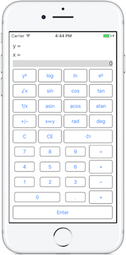

RPN Calculator (Xamarin.Forms)
===========================

This Xamarin.Forms app provides a "Reverse Polish Notation (RPN)" calculator you can use on your Android or iOS device

Follow the [setup instructions](https://developer.xamarin.com/guides/cross-platform/live/install) to try this out on your iPhone.

[xamarin.com/live](https://xamarin.com/live)
