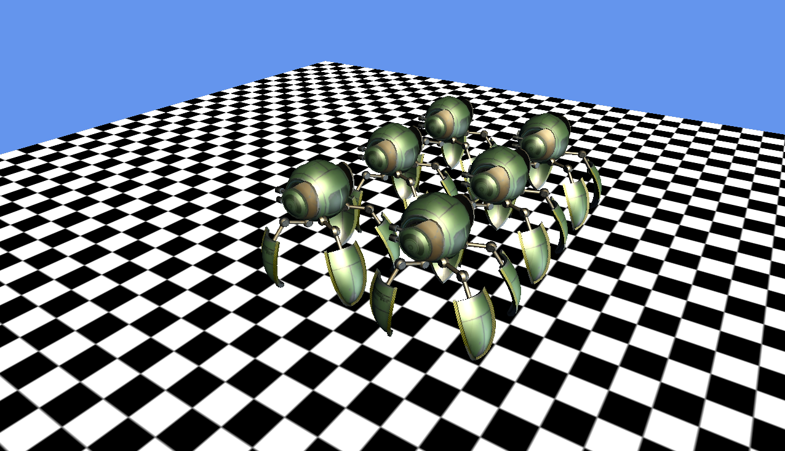

# Drawing with Vertices in MonoGame

This is a small demo game using MonoGame for iOS and Android, using a shared code project.  It is the result of working through the the article on [working with vertices in a MonoGame project](https://docs.microsoft.com/xamarin/graphics-games/monogame/3d/part2).

It is built against MonoGame 3.3.

