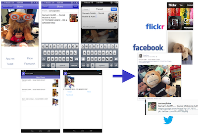

SoMA - Social, Mobile & Auth
=======

This sample demonstrates the newly open-sourced libraries:

* [Xamarin.Social source code](https://github.com/xamarin/Xamarin.Social)

* [Xamarin.Mobile source code](https://github.com/xamarin/Xamarin.Mobile)

* [Xamarin.Auth source code](https://github.com/xamarin/Xamarin.Auth)

in a simple app that lets you take a picture then post it to one of the supported social media services along with a comment and a link to your current GPS location. 

 

Because it requires a camera you should play with it on a real device. The sample code uses C# 5 async/await

You must register for access to each service - see the instructions in `Core/ServiceConstants.cs` to create the required accounts and add the credentials to the code.

If you don't want to build them yourself, all three are available from the [Xamarin Component Store](http://components.xamarin.com).

For further info, visit:

* [Xamarin.Mobile Open Sourced blog post](http://blog.xamarin.com/xamarin.mobile-new-improved-and-open-sourced)

* [Xamarin.Mobile web page](http://xamarin.com/mobileapi)

* and of course [Xamarin.com](http://xamarin.com)
