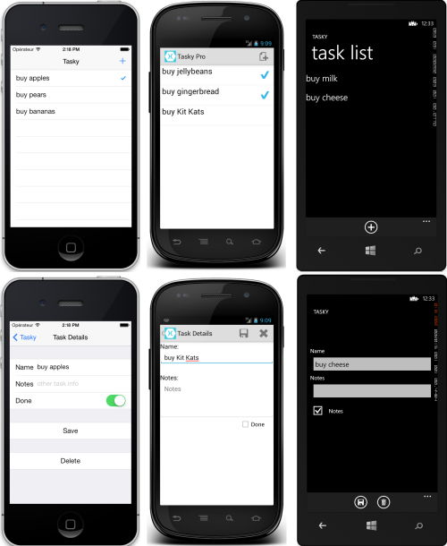

Tasky Pro
=========

TaskyPro is a simple cross-platform todo/task application sample that allows
you to track todo tasks. It illustrates proper application architecture
layering and uses a common code base for the Business Layer, Data Access
Layer, and Data Layer layers. It then separates out the User
Interface and Application Layer into the appropriate device-applications.

The application runs on iOS and Android with a set of 
common classes shared across all platforms. It uses Shared Asset
Projects for the common code that is referenced from all platform-specific
projects.

NOTE: it also supports some basic iOS localization to [Spanish](Screenshots/iOS/03-detail_spanish.png) and [Japanese](Screenshots/iOS/04-detail_japanese.png).

Xamarin.Forms Version
---------------------
The equivalent app written with [Xamarin.Forms](http://xamarin.com/forms) is called [Todo](https://github.com/xamarin/xamarin-forms-samples/tree/master/Todo).

Authors
-------

Bryan Costanich, Craig Dunn
