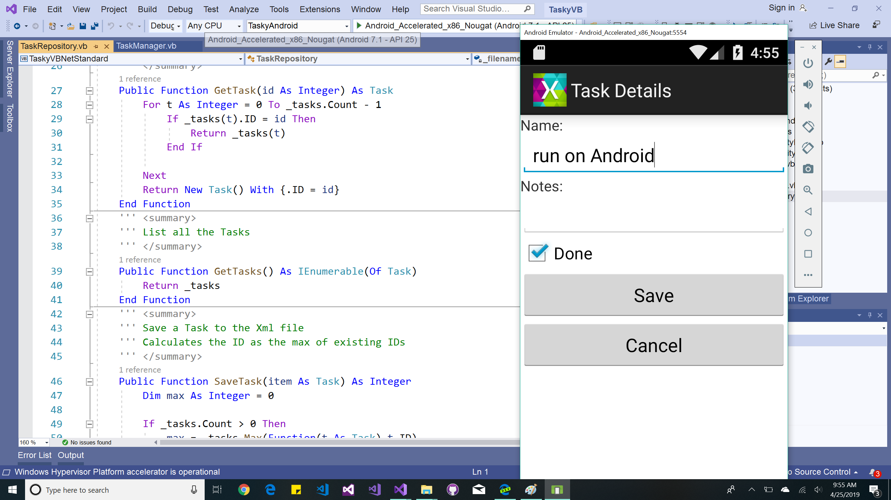

# TaskyVB (using .NET Standard)

Sample for the [Visual Basic and .NET Standard](https://docs.microsoft.com/xamarin/cross-platform/platform/visual-basic/native-apps) page on the [Xamarin Developer Portal](https://docs.microsoft.com/xamarin).

> [!IMPORTANT]
> This sample *requires* Visual Studio and the Mobile Development with .NET (Xamarin) workload installed.
>
> _^ if you *really* wanted to try it in Visual Studio 2019 for Mac, note that the Visual Basic project will not have syntax-highlighting, code-completion, or IntelliSense._

## Notes

This simple to-do list app demonstrates using a **.NET Standard** library to share code between Xamarin.iOS, Xamarin.Android and Windows apps.

To keep the code simple we use a single XML file as the data-store - it contains a serialized collection of Task objects that we read & write to when the user edits their to-do items.

If you are browsing the VB code, this
[Visual Basic Reference](https://docs.microsoft.com/dotnet/visual-basic/language-reference/) might come in handy ;)
