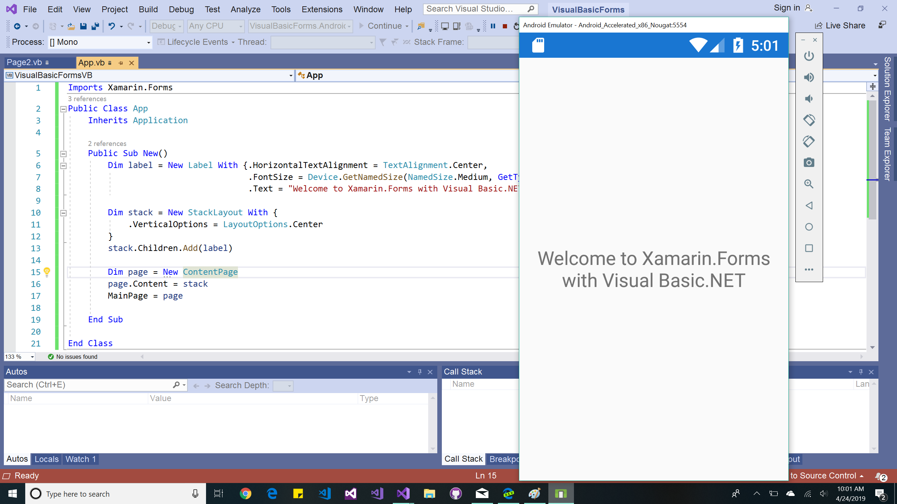

Xamarin.Forms with Visual Basic (using PCL)
=============

IMPORTANT
---------

This sample *requires* Visual Studio.

NOTES
-----

Combines [this info about creating Visual Basic PCLs](https://blog.xamarin.com/visual-basic-goes-mobile-with-portable-libraries/)
with the fact that Xamarin.Forms is based on PCLs to build a Xamarin.Forms app using Visual Basic.NET.

All the common code, including business logic *and* the user interface, is written in Visual Basic.NET.
The platform projects (for iOS and Android) must still be C# projects (since Xamarin does not support Visual Basic),
and if you want to use XAML, you need to put the XAML pages in a C# PCL project too. But all your code
can be Visual Basic.NET (well, except Custom Renderers and the Dependency Service, which need to be C# if they're required at all).

If you are browsing the VB code, this
[Visual Basic Reference](http://msdn.microsoft.com/en-us/library/sh9ywfdk.aspx) might come in handy ;)
