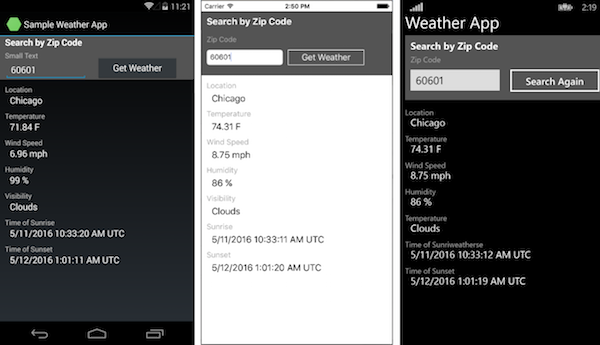

WeatherApp (Native iOS, Android, and Windows Phone)
===================

WeatherApp (Native) is an example that accompanies [Build apps with native UI using Xamarin in Visual Studio](https://msdn.microsoft.com/library/dn879698.aspx) (MSDN Library).

It consists of a PCL that contains all the business logic. The platform-specific projects for Android, iOS, and Windows each contain native UI layers.




To use this sample, you must first sign up for a free API key at [http://openweathermap.org/appid](http://openweathermap.org/appid). Paste that key in place of *YOUR API KEY HERE* in the following line of **WeatherApp/Core.cs**:

```
string key = "YOUR API KEY HERE";
```

Xamarin.Forms Version
---------------------

The equivalent app written with Xamarin.Forms is [Weather for Xamarin.Form](https://github.com/xamarin/xamarin-forms-samples/tree/master/Weather).


Authors
-------

Kraig Brockschmidt, Nicole Haugen
